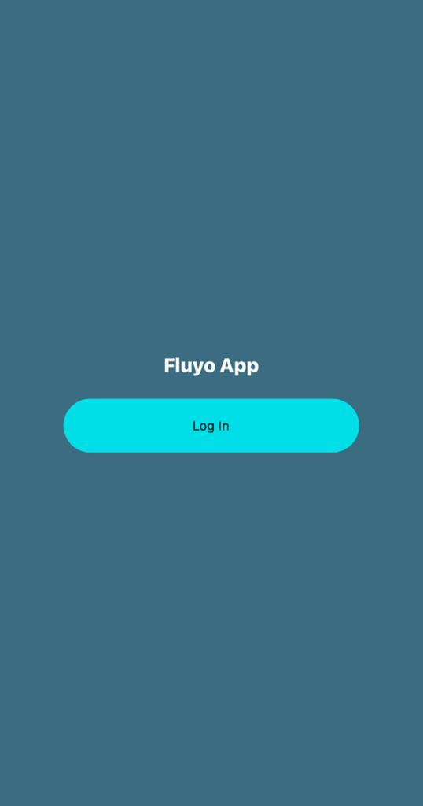
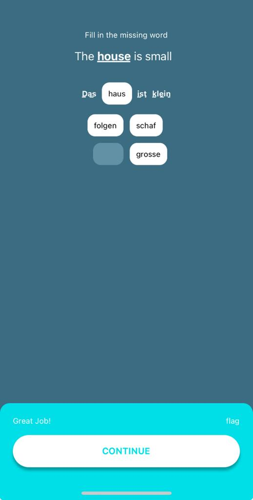
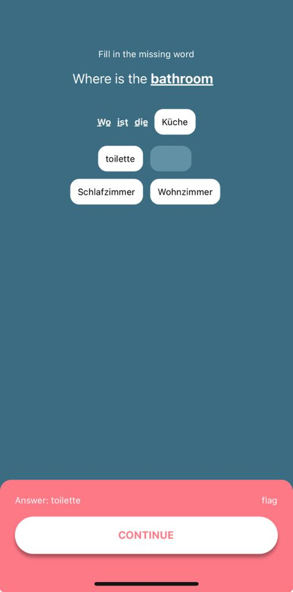
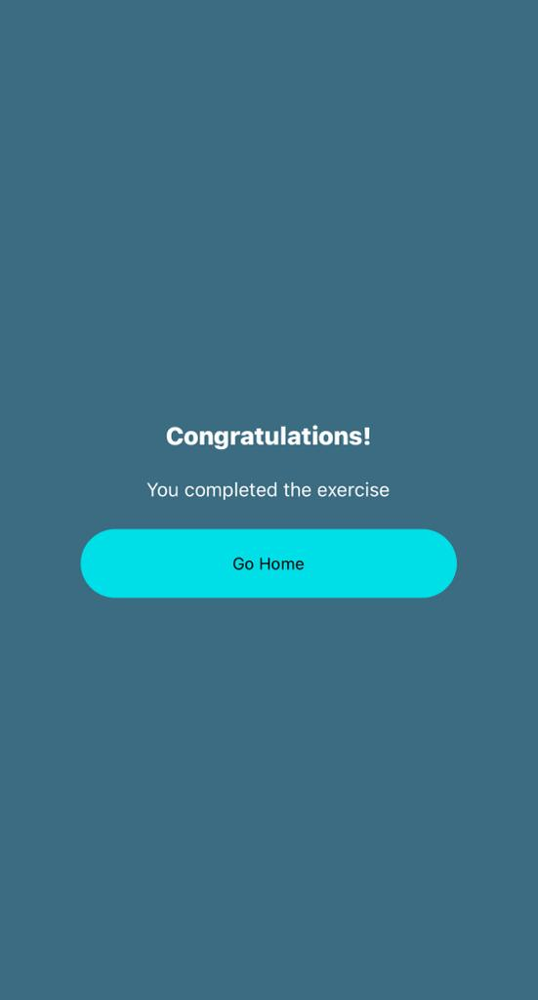
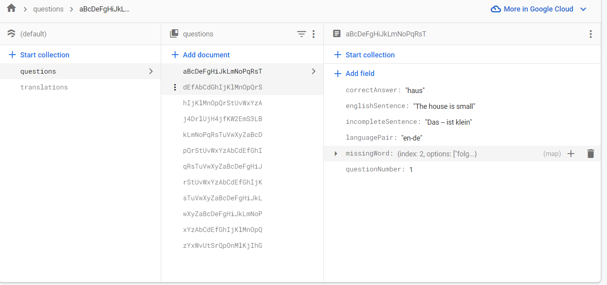
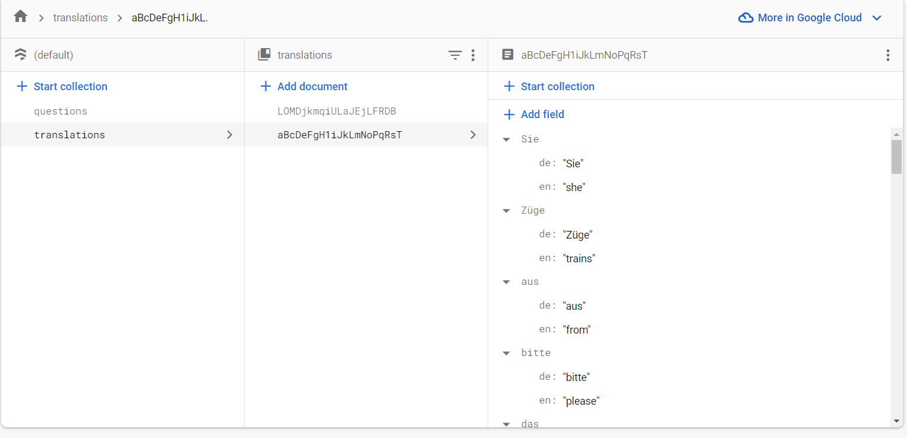

## Fluyo Test Demo

## Table of contents

- [Overview](#overview)
  - [The challenge](#the-challenge)
  - [Screenshots](#screenshots)
  - [Firebase Screenshots](#firebase-schema)
  - [Links](#links)
  - [Built with](#built-with)
- [Author](#author)

## Overview

- This is a demo app for Fluyo, a language-learning app. It was built with React Native(Expo), and TypeScript, all the data is in Firebase, and Redux was used for state management.

# IMPORTANT

- To run the app follow these steps:
- npm install
- npm start
- open in Expo go

Node version is v18.16.0

### The challenge

Users should be able to:

- Log in and start exercise
- Answer Questions and see if they are correct or not
- Click on a foreign word to see English translation

### Screenshots

### Firebase Schema

- A look at the Firebase Firestore
  
  

### Links

- Solution URL: [GitHub](https://github.com/mikenjuki/FluyoDemo)

### Built with

- React Native
- TypeScript
- Firebase
- CSS
- Redux
- React-Navigation
